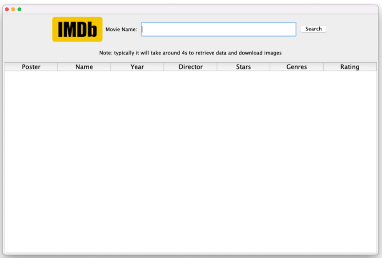
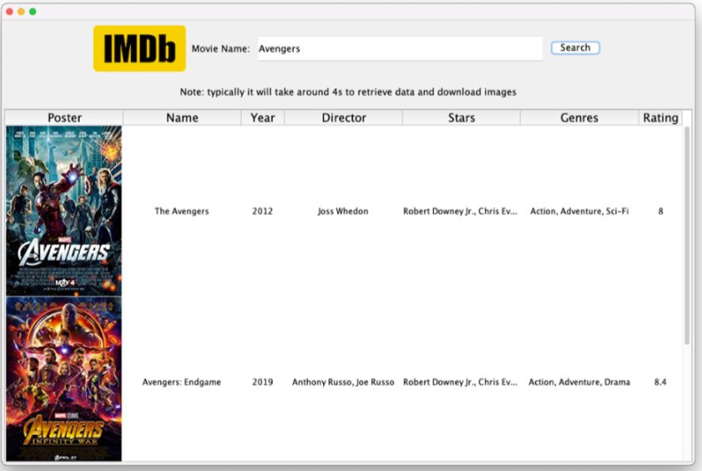
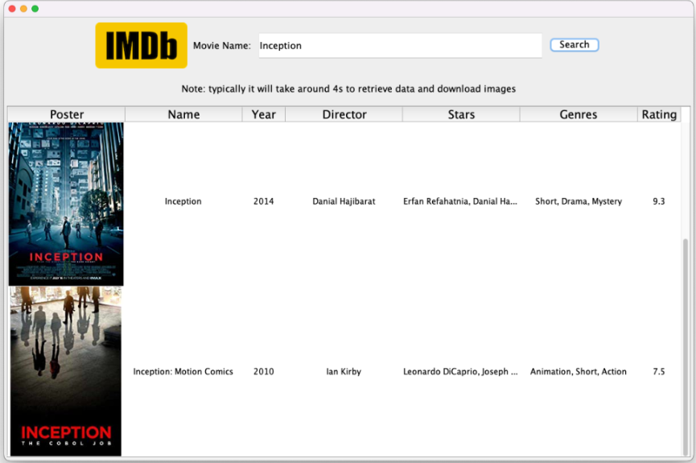

# IMDB_JavaSwing_SpringBoot

## introduction 

Build a Movie Information Crawler, which allow the user to input the name of the Movie, and obtain information (such as Poster, Year, Rate, Actor, and Genres) from IMDB, then display in the Java GUI. The project will use three advanced java feture: (1) GUI (2) Networking (3) Multithreads.(4)Spring Boot

## result

